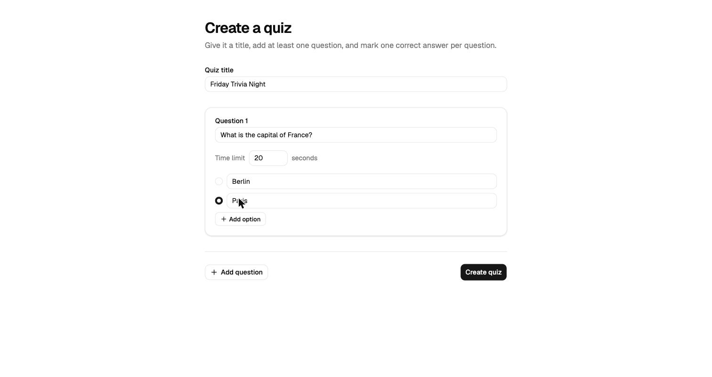
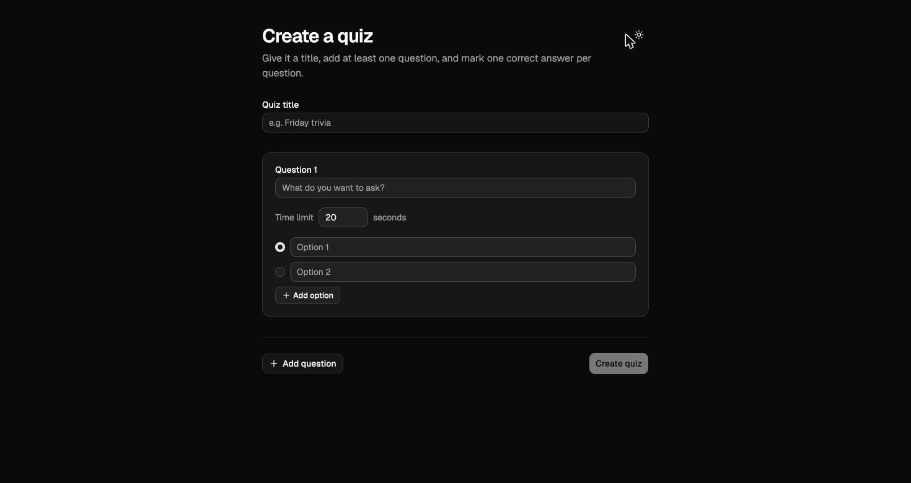
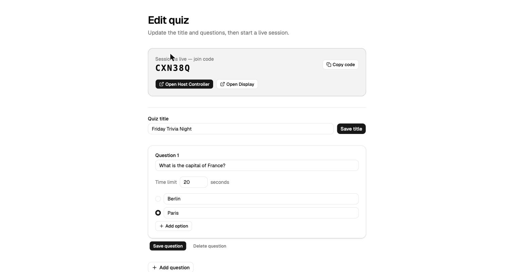
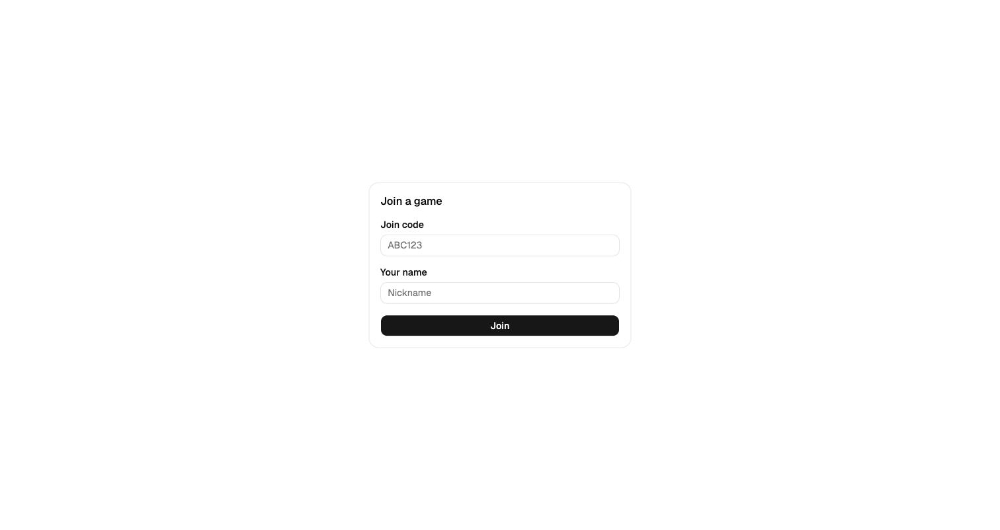
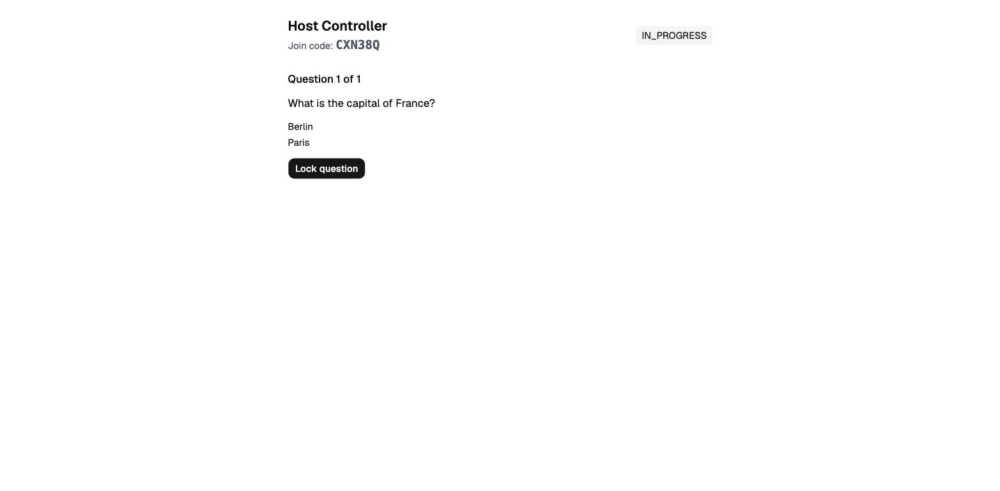
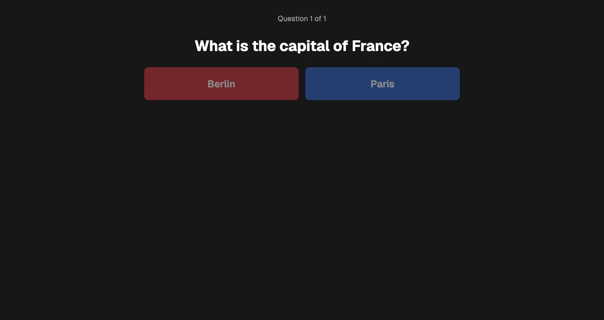
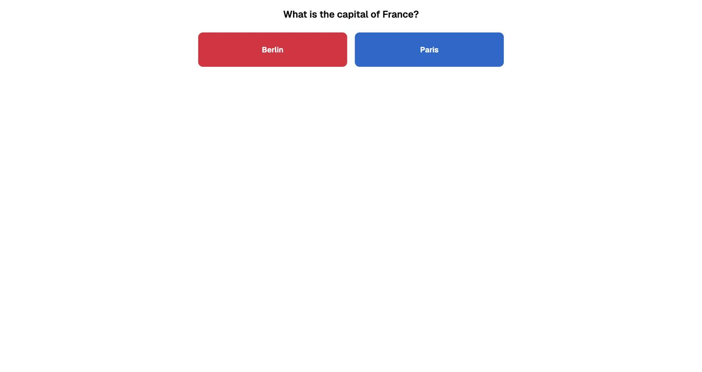
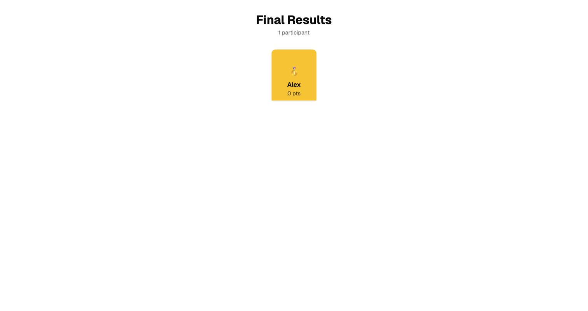

# Pulz

Live, real-time quiz platform (Kahoot!-style). Host runs a synchronous quiz
session; players join from any device via a short join code, answer on a
color/shape button grid, and see live scoring.

See:
- [`CLAUDE.md`](CLAUDE.md) — orientation for any agent/contributor picking
  this up
- [`docs/PRD.md`](docs/PRD.md) — product requirements, scope, flows
- [`docs/DESIGN.md`](docs/DESIGN.md) — domain model, state machine, event
  surface
- [`docs/ARCHITECTURE.md`](docs/ARCHITECTURE.md) — tech stack and infra
  choices, with reasoning
- [`docs/DECISIONS.md`](docs/DECISIONS.md) — quick-reference log of
  settled decisions
- [`docs/GO_V2_EXPLORATION.md`](docs/GO_V2_EXPLORATION.md) — scope of the
  `backend-go/` performance exploration (not the MVP backend)
- [`docs/FRONTEND_PLAN.md`](docs/FRONTEND_PLAN.md) — **current work in
  progress:** frontend plan, open design decisions, and progress checklist.
  Start here to continue the active work.

## Layout

- [`backend/`](backend/) — the real MVP backend (Node.js/TypeScript,
  Fastify + Socket.IO + Prisma/Postgres). Health check and Creator
  quiz-CRUD scaffolded; see `CLAUDE.md` for current status and next steps.
- [`backend-go/`](backend-go/) — **not** the MVP backend. A separate,
  low-priority Go performance-exploration module; see
  `docs/GO_V2_EXPLORATION.md`.
- [`frontend/`](frontend/) — React + Vite SPA. All seven routes (Creator
  flows, Host, Display, Join/Play, Results) are implemented, including the
  Creator→session hand-off. Manually verified end-to-end against a live
  backend and covered by a Playwright E2E test. See `docs/FRONTEND_PLAN.md`.

**Status:** MVP backend implemented and verified end-to-end; frontend's
full user journey (create → start session → host/display/play → results)
is implemented, manually verified end-to-end, and covered by an automated
E2E test — see `docs/FRONTEND_PLAN.md` for the plan/progress and how to
run the stack locally, and `CLAUDE.md` for the full up-to-date picture.

## Local development

`docker compose up --build` from the repo root starts Postgres, the
backend, and the frontend together. With that running,
`cd frontend && npm run test:e2e` runs the E2E suite — see
`docs/FRONTEND_PLAN.md` for details.

## Screenshots

| Create | Create (dark mode) |
| --- | --- |
|  |  |

| Edit + start session |
| --- |
|  |

| Join | Host controller |
| --- | --- |
|  |  |

| Display (cast) | Play |
| --- | --- |
|  |  |

| Results |
| --- |
|  |
